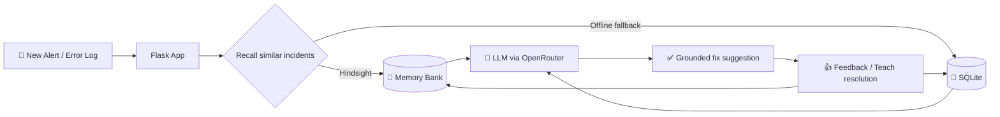

<div align="center">

#🧠 IncidentMind

### The on-call AI copilot that **learns from every outage**

*Stop solving the same incident twice.*

**🐍 Python 3.10+ &nbsp;•&nbsp; 🌶️ Flask &nbsp;•&nbsp; 🔀 OpenRouter &nbsp;•&nbsp; 🧠 Hindsight &nbsp;•&nbsp; 🗄️ SQLite**

</div>

---

## 🚨 The Problem

At 3 AM, an alert fires. Somewhere in a wiki, a Slack thread, or an engineer's head, the fix already exists, but nobody can find it. Worse, the **failed fixes** are rarely written down, so teams keep repeating them.

## 💡 The Solution

**IncidentMind** is an incident-response copilot with a real memory. It stores post-mortems *and* failed fixes, recalls the most relevant past incidents when a new alert arrives, and reflects on recurring patterns across your services. Every outage makes the next one faster to resolve.

---

## ✨ Features

| | Feature | Description |
|---|---|---|
| 🔍 | **Incident Solver** | Paste an alert or error log and get analysis plus similar historical incidents |
| 🔁 | **Memory Learning Loop** | Give feedback on whether a suggested fix worked, and memory improves |
| 🎓 | **Teach a Resolution** | Save a new resolution and the failed steps into memory |
| 📈 | **Insights** | Ask pattern questions across the active memory bank |
| 📊 | **Dashboard** | Track memory usage, incident counts, and fix success rate |
| 💾 | **Durable Local Storage** | Every memory is stored in SQLite and synced to Hindsight when available |

---

## 🏗️ How It Works



**The learning loop:** alert → recall → suggest → feedback → memory → smarter next time.

---

## 🧰 Tech Stack

- 🐍 **Python 3.10+**
- 🌶️ **Flask** for the web UI and orchestration
- 🔀 **OpenRouter** (OpenAI-compatible API) for LLM reasoning
- 🧠 **Hindsight** memory client for long-term incident memory
- 🗄️ **SQLite** for restart-safe, offline-capable local storage

---

## 🚀 Quick Start

**1. Create a virtual environment and install dependencies**

```bash
python -m venv .venv

# Windows
.venv\Scripts\activate
# macOS / Linux
source .venv/bin/activate

pip install -r requirements.txt
```

**2. Configure your environment**

```bash
# Windows
copy .env.example .env
# macOS / Linux
cp .env.example .env
```

Then fill in your keys (see [Environment Variables](#-environment-variables)).

**3. Run the app**

```bash
python app.py
```

**4. (Optional) Seed a demo bank**

```bash
python seed_data.py --bank-id devops-incidents
```

---
## **🛠️ Troubleshooting**

### Virtual environment is not activated

If the `python` or `pip` commands are not recognized, make sure the virtual environment is activated.

On Windows:

```bash
.venv\Scripts\activate
```

On macOS / Linux:

```bash
source .venv/bin/activate
```

### Missing environment variables

If the application reports a missing API key, verify that the `.env` file exists and contains the required values from `.env.example`.

At minimum, configure:

* `OPENROUTER_API_KEY`
* `HINDSIGHT_API_KEY` (required only when Hindsight synchronization is needed)

### Hindsight is unavailable

The application can continue using its local SQLite memory when Hindsight is unavailable. Check the sync status shown by the application before troubleshooting the external service.

### Dependencies are missing

If you encounter an import error after cloning the repository, install the project dependencies again:

```bash
pip install -r requirements.txt
```

## 🔐 Environment Variables

| Variable | Description | Default |
|---|---|---|
| `OPENROUTER_API_KEY` | OpenRouter API key | required |
| `OPENROUTER_MODEL` | Model override | `openrouter/free` |
| `HINDSIGHT_API_KEY` | Hindsight API key | required for sync |
| `HINDSIGHT_API_URL` | Hindsight endpoint | `https://api.hindsight.vectorize.io` |

---

## 🎬 Demo Flow

1. 🆕 Start with a **fresh, empty bank**
2. 🚨 **Analyze a sample alert** and see the no-history guidance
3. 🎓 **Teach the resolution** or submit feedback
4. 🔁 **Analyze a similar alert again** and watch the memory get recalled
5. 📈 Open the **Insights** tab and the **dashboard** to review trends

---

## 💾 Data & Persistence

- Memories and bank names live in `.incidentmind/memory.sqlite3`.
- Existing JSON memories in `.incidentmind/banks/` are **imported automatically, once**.
- With Hindsight configured, locally saved memories **sync on the next bank operation**.
- If Hindsight is unavailable, memories **stay safely in SQLite** and the app shows the sync status.
- Keep the SQLite database on the same machine to preserve local data.
- Runtime database and counter files are excluded from Git; the checked-in JSON bank remains as a one-time import source.

---

## 📁 Repository Structure

```text
IncidentMind/
├── app.py            # Flask UI routes and incident orchestration
├── templates/        # Responsive solver, resolution, and insights screens
├── static/
│   └── styles.css    # Application styling
├── seed_data.py      # Synthetic incident dataset loader
├── requirements.txt  # Python dependencies
└── .env.example      # Environment variable template
```

---

<div align="center">

**Built so your team never fixes the same outage twice.** 🛡️

</div>
